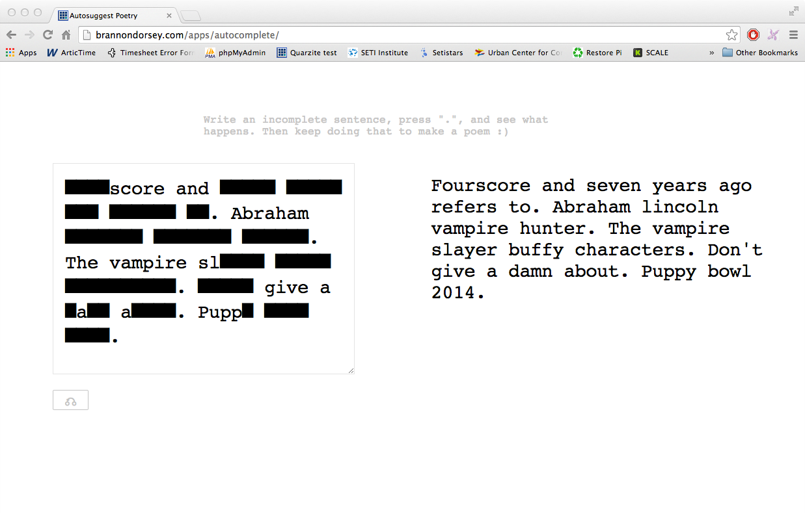

#Autocomplete Poetry

Autocomplete Poetry is an experimental writing tool that uses google's autocomplete results to create chance based language fragments.

This is an instructional repo used for various JavaScript demos, classes, and workshops presented by [Brannon Dorsey](http://brannondorsey.com).

##Important JavaScript methods
Below is a list of __every__ JavaScript (and [jQuery](http://jquery.com/)) method that we will use in our app. Some of their functions change when multiple parameters are used. Click each link for more info.

- [Array `push(item)`](https://developer.mozilla.org/en-US/docs/Web/JavaScript/Reference/Global_Objects/Array/push): Adds `item` to end of array.
- [Array `slice(index)`](https://developer.mozilla.org/en-US/docs/Web/JavaScript/Reference/Global_Objects/Array/slice): Returns a smaller (modified) array.
- [Array `indexOf(item)`](https://developer.mozilla.org/en-US/docs/Web/JavaScript/Reference/Global_Objects/Array/indexOf): Returns the index of the first identical `item` in the array.
- [Array `lastIndexOf(item)`](https://developer.mozilla.org/en-US/docs/Web/JavaScript/Reference/Global_Objects/Array/lastIndexOf): Returns the index of the last identical `item` in the array.
- [Array `join(string)`](https://developer.mozilla.org/en-US/docs/Web/JavaScript/Reference/Global_Objects/Array/join): Combines the array into a string with elements separated by `string`.
- [String `split(string)`](https://developer.mozilla.org/en-US/docs/Web/JavaScript/Reference/Global_Objects/String/split): Opposite of `join()`. Splits the string into an array where each element was separated by `string`.
- [String `charAt(index)`](https://developer.mozilla.org/en-US/docs/Web/JavaScript/Reference/Global_Objects/String/charAt): Returns the character at `index`.
- [String `substring(index)`](https://developer.mozilla.org/en-US/docs/XPath/Functions/substring): Returns a new string starting from `index`.
- [String `replace(find, replace)`](https://developer.mozilla.org/en-US/docs/Web/JavaScript/Reference/Global_Objects/String/replace): Replaces all instances of `find` in the string with `replace`.
- [String `trimLeft()`](https://developer.mozilla.org/en-US/docs/Web/JavaScript/Reference/Global_Objects/String/TrimLeft): Removes whitespace at the beginning of a string.
- [String `toLowerCase()`](https://developer.mozilla.org/en-US/docs/Web/JavaScript/Reference/Global_Objects/String/toLowerCase): Returns a new string with only lowercase characters.
- [String `toUpperCase()`](https://developer.mozilla.org/en-US/docs/Web/JavaScript/Reference/Global_Objects/String/toUpperCase): Returns a new string with only uppercase characters.
- [jQuery `getJSON(filepath)`](http://api.jquery.com/jquery.getjson/): Loads json at `filepath`. Can also load json from a URL.
- [jQuery `text()`](http://api.jquery.com/jquery.getjson/): Returns the text inside of the jQuery object. Can also be used to __set__ the text if an argument is passed in.
- [jQuery `val()`](http://api.jquery.com/jquery.getjson/): Returns the value of the jQuery object. Can also be used to __set__ the value if an argument is passed in.